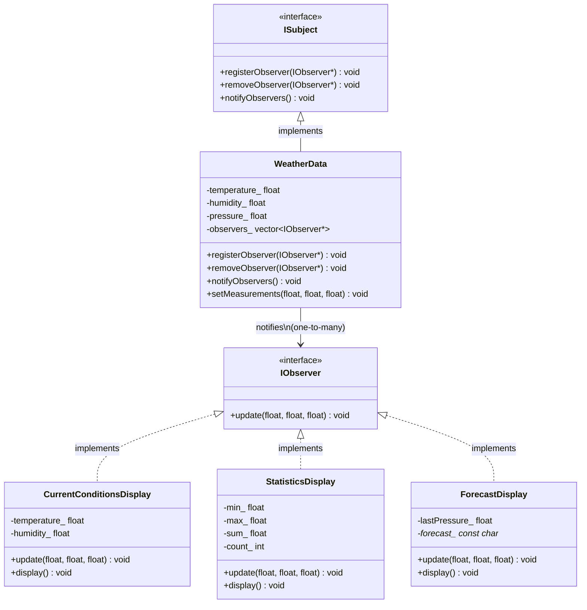

# Observer Pattern — Design & Analysis

> **Definition** (from *Design Patterns: Elements of Reusable Object-Oriented Software*, GoF):
>
> The Observer Pattern defines a one-to-many dependency between objects so that when one object changes state, all of its dependents are notified and updated automatically.

## How This Code Embodies the Pattern

Three core mechanics:

| Mechanism | Code | Pattern Principle |
|-----------|------|-------------------|
| Subject depends on interface, not concrete class | `std::vector<IObserver *> observers_` | Subject never knows *what* is observing — only that it obeys `IObserver` |
| One change triggers many updates | `setMeasurements()` → `notifyObservers()` → 3 `update()` calls | "one-to-many dependency" |
| Observers attach/detach at runtime | `registerObserver()` / `removeObserver()` | "makes them interchangeable" |

## UML Class Diagram (PlantUML / text)

```
     ┌─────────────────────────┐
     │      «interface»         │
     │        ISubject          │
     ├─────────────────────────┤
     │ + registerObserver(o)    │
     │ + removeObserver(o)      │
     │ + notifyObservers()      │
     └──────────┬──────────────┘
                △
                │  implements
     ┌──────────┴──────────────┐
     │      WeatherData         │  ◇───observers───▷ IObserver (depends-on, many)
     ├─────────────────────────┤
     │ - temperature_           │
     │ - humidity_              │
     │ - pressure_              │
     │ - observers_ : vector    │
     ├─────────────────────────┤
     │ + setMeasurements(t,h,p) │
     └─────────────────────────┘
                │  notifies (push)
                ▼
     ┌─────────────────────────┐
     │      «interface»         │
     │       IObserver          │
     ├─────────────────────────┤
     │ + update(t, h, p)        │
     └──────────┬──────────────┘
                △
                │  implements
    ┌───────────┼───────────────┐
    │           │               │
┌───┴───────┐ ┌─┴──────────┐ ┌──┴────────────┐
│CurrentCond│ │Statistics   │ │Forecast       │
│Display    │ │Display      │ │Display        │
├───────────┤ ├────────────┤ ├───────────────┤
│+ update() │ │+ update()  │ │+ update()     │
│+ display()│ │+ display() │ │+ display()    │
└───────────┘ └────────────┘ └───────────────┘
 «concrete observer»
```

## Mermaid (GitHub-native rendering)



## Relationship Layers

| Relationship | Type | UML Symbol | Direction | Meaning |
|------|------|---------|------|------|
| WeatherData → ISubject | Realization | △ dashed triangle | class→interface | WeatherData *implements* the Subject contract |
| Display → IObserver | Realization | △ dashed triangle | class→interface | Each display *implements* the Observer contract |
| WeatherData → IObserver | Dependency | → open arrow | Subject→Observer | WeatherData *depends on* IObserver (holds references, calls update) |

Key distinction from Strategy: Observer is **one-to-many** (Subject pushes to N observers), Strategy is **one-to-one** (Context delegates to 1 strategy).

## Observer Pattern Role Mapping

| Pattern Role | This Project's Class | Responsibility |
|--------|---------|------|
| Subject (interface) | `ISubject` | Defines register/remove/notify contract |
| ConcreteSubject | `WeatherData` | Owns state (temperature, humidity, pressure); calls `notifyObservers()` on state change |
| Observer (interface) | `IObserver` | Defines `update()` contract |
| ConcreteObserver | `CurrentConditionsDisplay`, `StatisticsDisplay`, `ForecastDisplay` | React to update; each extracts the data it needs |

## Push Model

This project uses the **push** model: the Subject sends all data to every Observer, and each Observer decides what to use:

```cpp
// Subject pushes all three values
void notifyObservers() override {
    for (auto *observer : observers_) {
        observer->update(temperature_, humidity_, pressure_);
    }
}

// Each Observer picks what it needs
void update(float t, float h, float /*pressure*/) override {  // Statistics ignores pressure
    // only uses t
}
```

Unused parameters are marked with `/*pressure*/` — the compiler sees `float`, suppresses the `-Wunused-parameter` warning under `-Wextra`.

## Dynamic Registration

Observers can register and deregister at runtime without any code change in the Subject:

```cpp
weatherData.registerObserver(&currentDisplay);   // 3 observers
weatherData.setMeasurements(27.0f, 65.0f, ...);  // 3 updates

weatherData.removeObserver(&statisticsDisplay);   // down to 2
weatherData.setMeasurements(26.0f, 90.0f, ...);  // 2 updates
```

## Execution Flow

```
weatherData.setMeasurements(27, 65, 1013)
  → temperature_ = 27, humidity_ = 65, pressure_ = 1013
  → notifyObservers()
      → currentDisplay.update(27, 65, 1013)
          → temperature_ = 27, humidity_ = 65
          → display() → "Current conditions: 27C degrees, 65% humidity"
      → statisticsDisplay.update(27, 65, 1013)
          → min=27, max=27, sum=27, count=1
          → display() → "Temperature stats: min 27C / avg 27C / max 27C"
      → forecastDisplay.update(27, 65, 1013)
          → lastPressure_ = 1013, last was 0 → "Improving weather on the way!"
```

## Comparison: Observer vs Strategy

| | Strategy Pattern | Observer Pattern |
|------|------------------|------------------|
| Dependency | Context **has-a** Strategy (1:1) | Subject **depends-on** Observers (1:N) |
| Call direction | Context calls Strategy | Subject pushes to Observers |
| Purpose | Encapsulate interchangeable algorithms | Notify dependents of state changes |
| Registration | Strategy set once, swapped on demand | Observers register/deregister dynamically |
| Coupling | Context knows the strategy interface | Subject knows nothing about who listens |

**Key insight**: The Subject and Observer layers **vary independently**. Adding a new display (HeatIndexDisplay) requires zero changes to WeatherData. Adding a new Subject (WindData) requires zero changes to existing displays. This is the core value of the Observer pattern.
