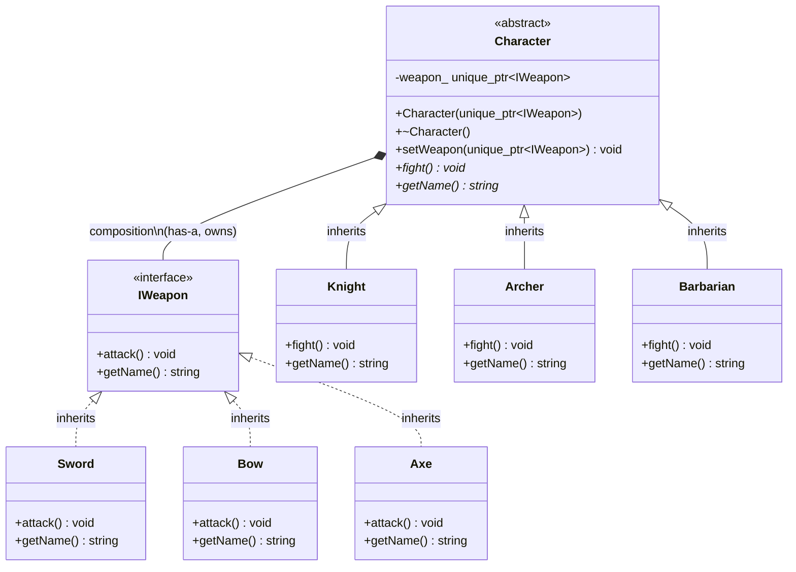

# Strategy Pattern — Design & Analysis

> **Definition** (from *Design Patterns: Elements of Reusable Object-Oriented Software*, GoF):
>
> The Strategy Pattern defines a family of algorithms, encapsulates each one, and makes them interchangeable. Strategy lets the algorithm vary independently from clients that use it.

## UML Class Diagram (PlantUML / text)

```
                    ┌─────────────────────┐
                    │     «interface»      │
                    │       IWeapon        │
                    ├─────────────────────┤
                    │ + attack() : void    │  (pure virtual, = 0)
                    │ + getName() : string │  (pure virtual, = 0)
                    └──────────┬──────────┘
                              △
                              │  inheritance (is-a)
                ┌─────────────┼─────────────┐
                │             │             │
      ┌────────┴────────┐ ┌──┴──────────┐ ┌┴──────────────┐
      │      Sword       │ │    Bow      │ │     Axe        │
      ├─────────────────┤ ├─────────────┤ ├───────────────┤
      │ + attack()      │ │ + attack()  │ │ + attack()    │
      │ + getName()     │ │ + getName() │ │ + getName()   │
      └─────────────────┘ └─────────────┘ └───────────────┘
          «concrete strategy»


      ┌──────────────────────────────────────────┐
      │           «abstract»                     │
      │           Character                      │  (cannot instantiate)
      ├──────────────────────────────────────────┤
      │ - weapon_ : unique_ptr<IWeapon>          │  ◇─── IWeapon (composition)
      ├──────────────────────────────────────────┤
      │ + Character(unique_ptr<IWeapon>)          │
      │ + ~Character()                           │
      │ + setWeapon(unique_ptr<IWeapon>) : void   │
      │ + fight() : void                         │  (pure virtual)
      │ + getName() : string                     │  (pure virtual)
      └────────────────────┬─────────────────────┘
                           △
                           │  inheritance (is-a)
             ┌─────────────┼─────────────┐
             │             │             │
   ┌────────┴────────┐ ┌──┴──────────┐ ┌┴──────────────┐
   │     Knight       │ │   Archer    │ │  Barbarian     │
   ├─────────────────┤ ├─────────────┤ ├───────────────┤
   │ + fight()       │ │ + fight()   │ │ + fight()     │
   │ + getName()     │ │ + getName() │ │ + getName()   │
   └─────────────────┘ └─────────────┘ └───────────────┘
       «concrete context»
```

## Mermaid (GitHub-native rendering)



## Three Relationship Layers

| Relationship | Type | UML Symbol | Direction | Meaning |
|------|------|---------|------|------|
| Sword → IWeapon | Inheritance (is-a) | △ hollow triangle | child→parent | Sword is an IWeapon |
| Knight → Character | Inheritance (is-a) | △ hollow triangle | child→parent | Knight is a Character |
| Character → IWeapon | Composition (has-a) | ◆ filled diamond | Context→Strategy | Character owns IWeapon, delegates attack |

## Strategy Pattern Role Mapping

| Pattern Role | This Project's Class | Responsibility |
|--------|---------|------|
| Strategy (interface) | `IWeapon` | Defines the algorithm signature |
| ConcreteStrategy | `Sword`, `Bow`, `Axe` | Implements specific algorithm |
| Context | `Character` | Holds strategy reference, delegates calls |
| ConcreteContext | `Knight`, `Archer`, `Barbarian` | Concrete context |

**Key insight**: The Character and IWeapon layers **vary independently**. Adding a new weapon (Dagger) does not require changing Character; adding a new character (Wizard) does not require changing IWeapon. This is the core value of the Strategy pattern.
