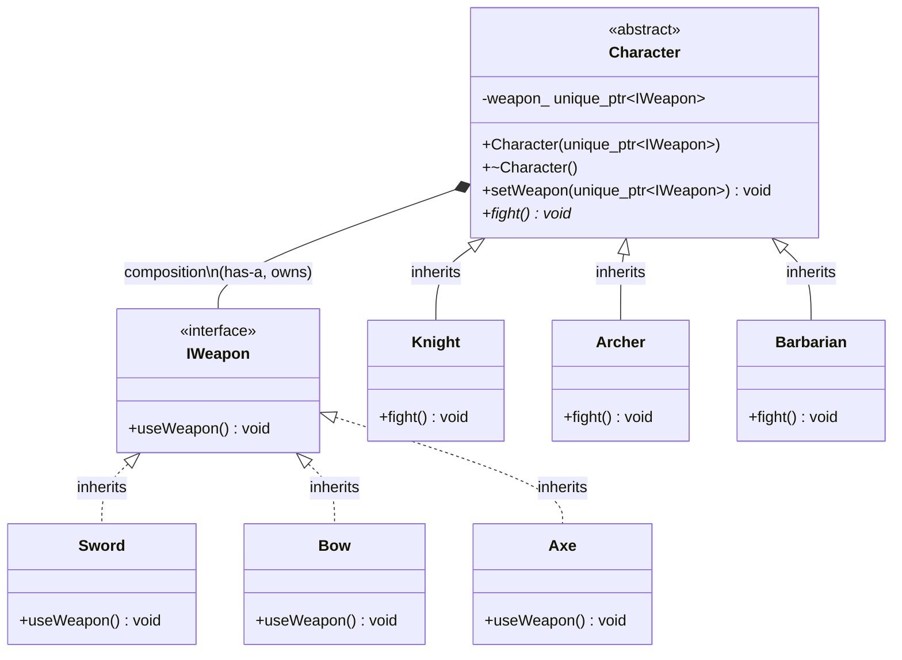

# Strategy Pattern — Design & Analysis

> **Definition** (from *Design Patterns: Elements of Reusable Object-Oriented Software*, GoF):
>
> The Strategy Pattern defines a family of algorithms, encapsulates each one, and makes them interchangeable. Strategy lets the algorithm vary independently from clients that use it.

## UML Class Diagram (PlantUML / text)

```
                    ┌─────────────────────┐
                    │     «interface»      │
                    │       IWeapon        │
                    ├─────────────────────┤
                    │ + useWeapon() : void │  (pure virtual, = 0)
                    └──────────┬──────────┘
                              △
                              │  inheritance (is-a)
                ┌─────────────┼─────────────┐
                │             │             │
      ┌────────┴────────┐ ┌──┴──────────┐ ┌┴──────────────┐
      │      Sword       │ │    Bow      │ │     Axe        │
      ├─────────────────┤ ├─────────────┤ ├───────────────┤
      │ + useWeapon()   │ │ + useWeapon()│ │ + useWeapon() │
      └─────────────────┘ └─────────────┘ └───────────────┘
          «concrete strategy»


      ┌──────────────────────────────────────────┐
      │           «abstract»                     │
      │           Character                      │  (cannot instantiate)
      ├──────────────────────────────────────────┤
      │ - weapon_ : unique_ptr<IWeapon>          │  ◇─── IWeapon (composition)
      ├──────────────────────────────────────────┤
      │ + Character(unique_ptr<IWeapon>)          │
      │ + ~Character()                           │
      │ + setWeapon(unique_ptr<IWeapon>) : void   │
      │ + fight() : void                         │  (pure virtual)
      └────────────────────┬─────────────────────┘
                           △
                           │  inheritance (is-a)
             ┌─────────────┼─────────────┐
             │             │             │
   ┌────────┴────────┐ ┌──┴──────────┐ ┌┴──────────────┐
   │     Knight       │ │   Archer    │ │  Barbarian     │
   ├─────────────────┤ ├─────────────┤ ├───────────────┤
   │ + fight()       │ │ + fight()   │ │ + fight()     │
   └─────────────────┘ └─────────────┘ └───────────────┘
       «concrete context»
```

## Mermaid (GitHub-native rendering)



## Three Relationship Layers

| Relationship | Type | UML Symbol | Direction | Meaning |
|------|------|---------|------|------|
| Sword → IWeapon | Inheritance (is-a) | △ hollow triangle | child→parent | Sword is an IWeapon |
| Knight → Character | Inheritance (is-a) | △ hollow triangle | child→parent | Knight is a Character |
| Character → IWeapon | Composition (has-a) | ◆ filled diamond | Context→Strategy | Character owns IWeapon, delegates to it |

## Strategy Pattern Role Mapping

| Pattern Role | This Project's Class | Responsibility |
|--------|---------|------|
| Strategy (interface) | `IWeapon` | Defines the algorithm signature (`useWeapon()`) |
| ConcreteStrategy | `Sword`, `Bow`, `Axe` | Implements specific algorithm |
| Context | `Character` | Holds strategy reference, delegates calls |
| ConcreteContext | `Knight`, `Archer`, `Barbarian` | Concrete context |

## Naming Convention

This project follows the **item-oriented** naming convention:

| Convention | Interface | Method | Call Site |
|------------|-----------|--------|-----------|
| Item-oriented | `IWeapon` | `useWeapon()` | `weapon_->useWeapon()` |
| Behavior-oriented | `IAttackBehavior` | `attack()` | `behavior_->attack()` |

Both are valid. The key rule is to pick one and stay consistent across all files.

## Build System (Makefile)

```makefile
CXX      := g++
CXXFLAGS := -std=c++17 -Wall -Wextra

TARGET   := strategy_pattern
SRC      := main.cpp
OBJ      := $(SRC:.cpp=.o)

.PHONY: all clean

all: $(TARGET)

$(TARGET): $(OBJ)
	$(CXX) $(CXXFLAGS) -o $@ $^

$(OBJ): $(SRC) iweapon.h character.h
	$(CXX) $(CXXFLAGS) -c -o $@ $<

clean:
	rm -f $(TARGET) $(OBJ)
```

### Anatomy of a Rule

Each rule has three parts:

| Position | Name | What | Example |
|----------|------|------|---------|
| 1st | **target** | File to generate or action name | `main.o`, `clean` |
| 2nd | **prerequisites** | Files the target depends on | `main.cpp iweapon.h character.h` |
| 3rd | **recipe** | Shell commands to run (must be indented with **Tab**) | `g++ -c -o $@ $<` |

```
target : prerequisites
	recipe
```

### Variable Definitions

| Line | Meaning |
|------|---------|
| `CXX := g++` | Compiler |
| `CXXFLAGS := -std=c++17 -Wall -Wextra` | C++17 standard, all common warnings |
| `TARGET := strategy_pattern` | Output binary name |
| `SRC := main.cpp` | Source file(s) |
| `OBJ := $(SRC:.cpp=.o)` | Suffix substitution: `main.cpp` → `main.o` |

### Make Variable Assignment Operators

Four assignment operators with different expansion semantics:

| Operator | Behavior | When to Use |
|----------|----------|-------------|
| `=` | **Deferred expansion** — right-hand side is re-evaluated every time the variable is read | When you need "define later, use earlier" |
| `:=` | **Immediate expansion** — right-hand side is evaluated once at definition time and frozen | Most cases (simpler, faster, no surprises) |
| `?=` | **Conditional assignment** — only sets the value if the variable is not already defined | Giving defaults that users can override via env/command line |
| `+=` | **Append** — appends to the existing value (inherits the expansion mode of the original variable) | Building up lists of flags or source files incrementally |

#### Deferred (`=`) vs Immediate (`:=`) Expansion

```
= (deferred)                          := (immediate)
─────────────────────────             ─────────────────────────
X = hello                             A := hello
Y = $(X)    ← not evaluated yet       B := $(A)    ← evaluated NOW, B = hello
X = world    ← X changed              A := world    ← A changed
→ $(Y) = world                        → $(B) = hello (frozen at definition time)
```

Mental model:
- **`=`** is a **shortcut/alias** — every time you read it, it resolves to the current live value. Like a desktop shortcut that always opens the latest version of a file.
- **`:=`** is a **snapshot** — the value is captured once and locked. Like copy-pasting the file; later changes to the original don't affect your copy.

Why `:=` is the default choice:
- **Performance**: evaluated once, not every reference
- **Safety**: no infinite recursion (`A = $(B); B = $(A)` loops forever under `=`, errors under `:=`)
- **Clarity**: no surprises from later assignments silently changing values

#### Conditional (`?=`) and Append (`+=`)

```makefile
CXX ?= g++            # "if CXX is not set, default to g++"
                       # Allows: make CXX=clang++

CXXFLAGS := -std=c++17
CXXFLAGS += -Wall     # "append -Wall to existing CXXFLAGS"
CXXFLAGS += -Wextra   # result: -std=c++17 -Wall -Wextra
```

`+=` inherits the expansion behavior from how the variable was first defined:
- If `X` was defined with `=`, then `X += foo` stays deferred
- If `X` was defined with `:=`, then `X += foo` stays immediate
- If `X` was defined with `?=`, then `X += foo` stays conditional |

### Automatic Variables

| Variable | Meaning | Memory Trick |
|----------|---------|--------------|
| `$@` | The **target** file | `@` = bullseye, the target |
| `$^` | **All** prerequisites | `^` = umbrella, covers everything |
| `$<` | The **first** prerequisite | `<` = arrow, first one in |

### Link vs Compile Rules

```makefile
# Link: needs all .o files
$(TARGET): $(OBJ)
	$(CXX) $(CXXFLAGS) -o $@ $^          # $^ = main.o

# Compile: only needs the .cpp; headers listed for dependency tracking only
$(OBJ): $(SRC) iweapon.h character.h
	$(CXX) $(CXXFLAGS) -c -o $@ $<      # $< = main.cpp (first prerequisite)
```

- `$^` passes all prerequisites to the linker
- `$<` passes only the first prerequisite (the `.cpp`) to the compiler — headers must NOT be compiled as source files
- Headers are listed so make knows to recompile when they change

### Compiler Flags: `-c` and `-o`

#### `-c` — Compile only (no link)

```bash
g++ -c main.cpp           # → main.o (object file, not executable)
g++ -c main.cpp -o x.o    # → x.o
```

Without `-c`, g++ compiles *and* links in one step, producing `a.out`. With `-c`, it stops at the `.o` stage — syntax is checked and machine code is generated, but external symbols (standard library calls, other `.o` files) are not yet resolved.

#### `-o` — Output file name

```bash
g++ -o demo main.cpp      # → demo (not a.out)
g++ -c -o main.o main.cpp # → main.o
```

Without `-o`, the default output name is `a.out`. Always use `-o` to give the output a meaningful name.

#### Why split compile and link

```
main.cpp    ── g++ -c ──→ main.o ──┐
                                    ├── g++ (link) ──→ strategy_pattern
iweapon.h ──────────────────────────┘                    ↑
                                                  libstdc++ (C++ std lib)
```

- **Compile** (`-c`): `.cpp` → `.o`. Checks syntax only; external symbols are left as unresolved references.
- **Link** (no `-c`): `.o` + libraries → executable. Resolves all symbols into final addresses.

For a single-file project you *could* skip the split:

```bash
g++ main.cpp -o strategy_pattern   # compile + link in one shot
```

The Makefile splits them so the structure scales naturally when more source files are added — just extend the dependency list, no rule changes needed.

### .PHONY

```makefile
.PHONY: all clean
```

Tells make that `all` and `clean` are **actions**, not files. Without it, a file named `clean` in the directory would prevent `make clean` from running.

### Execution Flow

```
make
  → all depends on strategy_pattern
    → strategy_pattern depends on main.o
      → main.o depends on main.cpp, iweapon.h, character.h
        → g++ -c main.cpp → main.o       (compile)
    → g++ main.o → strategy_pattern      (link)
```

**Key insight**: The Character and IWeapon layers **vary independently**. Adding a new weapon (Dagger) does not require changing Character; adding a new character (Wizard) does not require changing IWeapon. This is the core value of the Strategy pattern.
